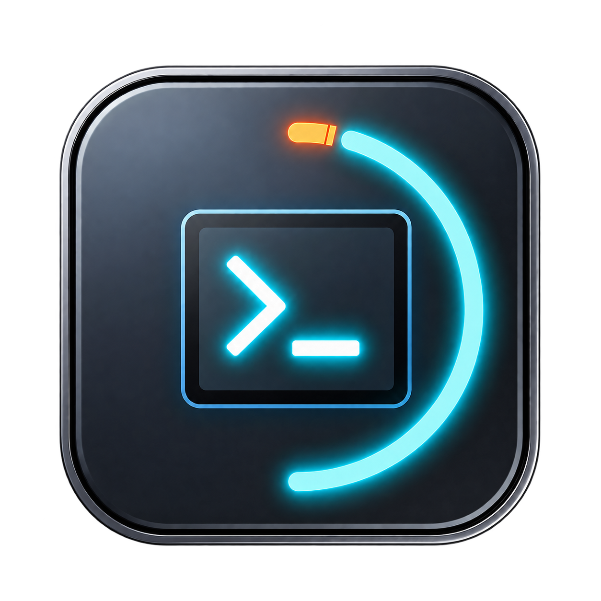
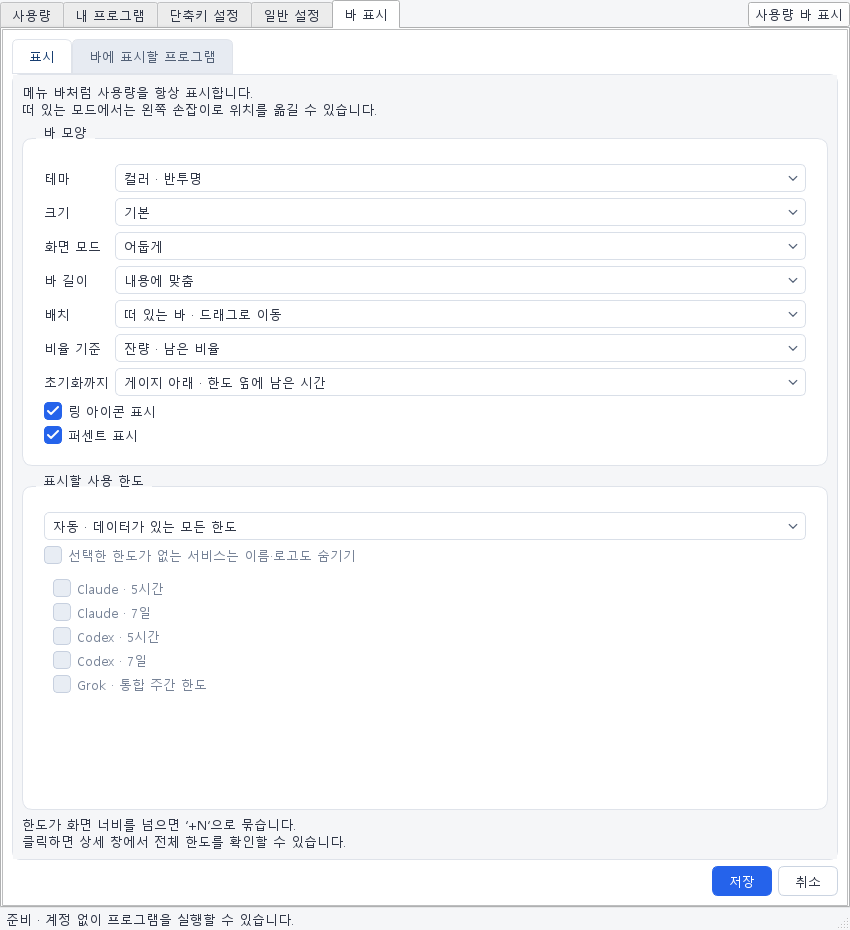
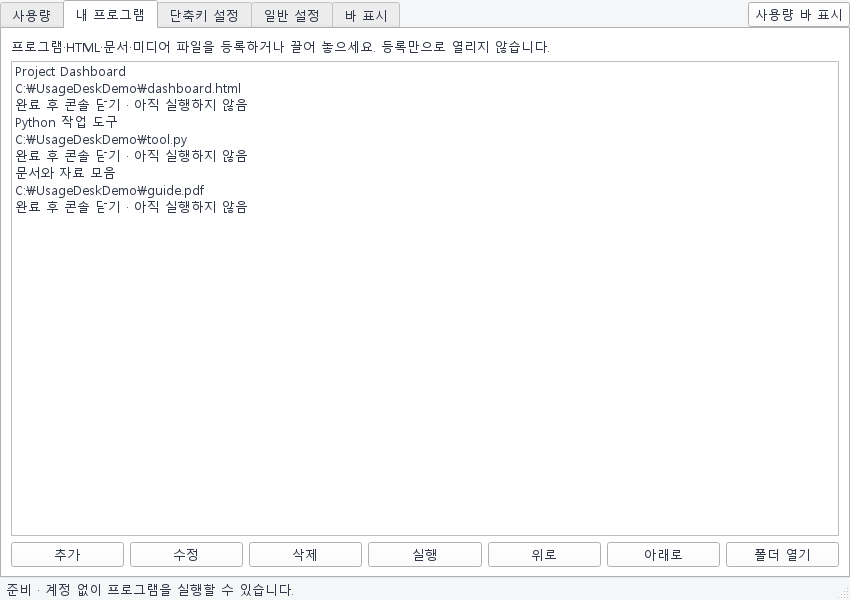
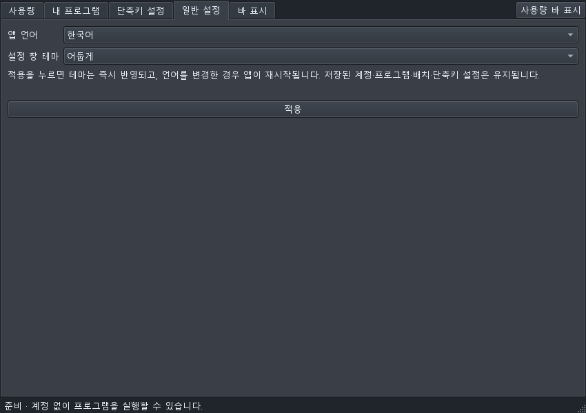
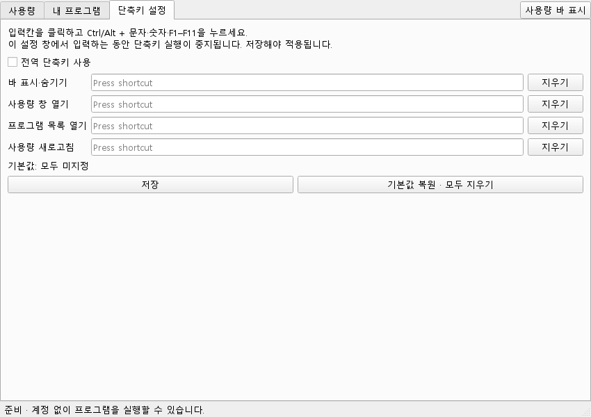

[**한국어**](README.md) | [English](README.en.md)

<p align="center">
  
</p>

# UsageDesk

**AI 사용 한도와 자주 여는 프로그램·파일을, Windows 바 하나에.**

Claude · Codex · Grok의 사용량과 초기화 시간을 확인하고, 프로그램·HTML·문서를 같은 바에서 여는 Windows 데스크톱 유틸리티입니다.

Windows 11 · Python 3.13 · PySide6 · **0.1.0a19 / Alpha** · [MIT](LICENSE)


> 화면은 실제 앱 위젯을 **예시 데이터**로 실행해 만든 이미지입니다. 실제 계정 사용량, 개인 파일 경로, 인증정보는 포함하지 않습니다. 비율은 잔량 모드입니다.

## 주요 기능

- **세 서비스의 한도를 한곳에서** — Claude, ChatGPT 계정의 Codex, Grok CLI 계정의 한도를 표시합니다.
- **사용량 / 잔량 선택** — 숫자와 링을 함께 전환합니다.
- **초기화까지 남은 시간** — `7d │ 초기화 23hr 44min`처럼 주기와 남은 시간을 구분합니다. 호버로 정확한 날짜·시각과 조회 상태를 확인합니다.
- **떠 있는 바 / 상단·하단 고정 / 트레이 전용** — 드래그 이동, 작업 영역 확보, 바 없이 트레이만 표시하는 모드를 선택합니다.
- **프로그램·파일 바로 열기** — EXE·BAT·Python 스크립트, HTML·PDF·문서·이미지를 등록합니다.
- **긴 이름은 두 줄로** — 여백과 글자 크기를 조절하고 남는 공간을 활용한 뒤, 넘치는 항목을 `+N` 메뉴에 모읍니다.
- **표시 설정** — 크기, 색상, 밝게/어둡게, 표시할 한도와 프로그램을 선택합니다.

[Usage4Claude](https://github.com/f-is-h/Usage4Claude)에서 영감을 받아 Python/Qt로 작성한 독립적인 Windows 앱입니다. 원본의 공식 Windows 버전이 아니며 Anthropic, OpenAI, xAI와 제휴 관계가 없습니다.

## 통합 설정·언어·서비스 숨김

- 톱니바퀴 또는 **⋯ → 설정**에서 하나의 관리 창을 엽니다. 바 표시·프로그램 관리·단축키·일반 설정을 같은 창의 탭에서 관리하며, 메뉴의 설정 항목은 구분선 아래에 모았습니다.
- **일반 설정 → 설정 창 테마**에서 **시스템 / 밝게 / 어둡게**를 선택하고 **적용**을 누르면 즉시 반영됩니다. 바의 화면 모드와 별도로 설정할 수 있습니다.
- 상세 창의 **일반 설정 → 앱 언어**에서 **한국어 / English**를 고른 뒤 **적용**을 누릅니다. 언어를 변경하면 앱이 자동 재시작됩니다. 계정·등록한 파일·단축키·바 배치는 유지됩니다. 기본 언어는 한국어입니다.
- **바 표시 → 표시 → 표시할 사용 한도**에서 **직접 선택**과 **선택한 한도가 없는 서비스는 이름·로고도 숨기기**를 켜면, 한도를 모두 해제한 서비스는 바에서 이름·로고까지 사라집니다. 기본값은 서비스 이름 유지이며 자동 표시 모드에는 영향을 주지 않습니다. 숨겨진 서비스도 상세 창에서 확인할 수 있습니다.
- 사용자 지정 프로그램 이름·경로는 바뀌지 않으며, Windows 파일 선택창 등 운영체제 창은 Windows 언어를 따릅니다.

## 화면 미리보기

### 0.1.0a18 표시 개선

- 설정 창을 화면 작업 영역 내에서 최대 960×820으로 열며, 바 표시의 저장·취소 버튼은 스크롤 밖 하단에 고정됩니다.
- 프로그램 이름은 바 기본 글자보다 1pt 작게, 좌우 여백은 6px로 표시합니다. 혼잡하면 여백 4px 및 한 단계 추가 축소 후 `+N` 메뉴를 사용합니다.
- **바 표시 → 표시 → 바 모양**에서 **로컬 AI 앱·CLI CPU 표시**, **프로그램 CPU 표시**를 각각 켜고 끕니다. 기본값은 꺼짐이며 약 2초 간격으로 전체 논리 CPU 용량 기준 0–100%를 계산합니다. 클라우드 AI 서버 사용률이 아닙니다.
- AI는 `claude.exe`, `codex.exe`, `grok.exe`와 관측된 자식 프로세스, 프로그램은 UsageDesk에서 실행해 추적 가능한 프로세스를 측정합니다. 다른 이름의 실행기, 공유 브라우저에서 열린 HTML·문서, 접근 불가 프로세스는 개별 CPU를 확정할 수 없어 `CPU —`로 표시합니다. 짧게 실행되고 종료된 프로세스는 표본 사이에 누락될 수 있습니다.

**밝은 테마**


**항목이 많을 때 — 한 줄 바와 `+N` 메뉴 유지**


<details>
<summary><strong>표시 설정 보기</strong></summary>
<p></p>
</details>

<details>
<summary><strong>프로그램·파일 등록 화면 보기</strong></summary>
<p></p>
</details>



## 시작하기

소스 실행과 **Windows x64 포터블 알파 빌드**를 지원합니다. 공개 Release는 아직 게시하지 않았으며, 서명된 설치 프로그램은 제공하지 않습니다. 배포 시 EXE ZIP·원본 소스 ZIP·SHA256 체크섬을 함께 제공합니다. [배포 및 라이선스 안내](DISTRIBUTION.md)를 확인하세요.

필요 환경: **Windows 11 x64**, [uv](https://github.com/astral-sh/uv).

저장소를 내려받아 압축을 풀거나 복제한 다음, 프로젝트 폴더에서 PowerShell을 엽니다.

```powershell
.\setup.ps1
.\run.cmd
```

`setup.ps1`은 `uv.lock` 기준으로 Python 3.13과 의존성을 프로젝트 내부에 설치합니다. 설치 후에는 `run.cmd`를 더블클릭해도 됩니다.

Smart App Control이 자동 설치된 Python을 차단하면 보안 정책을 끄지 말고, 서명된 python.org 공식 Python 3.13을 설치한 후 `./setup.ps1 -Python '공식 Python의 python.exe 경로'`로 구성하세요. 프로젝트의 `.python/official-3.13.15/python.exe`가 있으면 우선 사용합니다.

게이지를 클릭하면 상세 창이 열립니다. 표시 설정의 배치에서 트레이 전용을 선택하면 바와 상세 창이 숨겨지고, 다음 실행에도 유지됩니다. 트레이 메뉴의 `사용량 바 표시`로 이전 배치·위치를 복원합니다. 트레이 전환 전 상단/하단 고정 여부와 위치는 재실행 후에도 유지됩니다. 상세 창을 닫으면 바로 돌아가며, 완전히 종료하려면 바의 `⋯ → 종료` 또는 트레이의 `종료`를 사용하세요.

```powershell
# 상세 창과 함께 시작
.\.venv\Scripts\python.exe -m usagedesk.app --window

# 테스트용 설정을 별도 폴더에 저장
.\.venv\Scripts\python.exe -m usagedesk.app --data-dir .dev-data
```

## 계정 연결

**Claude / Codex**

1. 상세 창의 `사용량`에서 서비스의 `로그인 / 다시 연결`을 누릅니다.
2. `브라우저 로그인 시작`을 누르고 브라우저에서 로그인·승인합니다.
3. 자동 연결이 실패하면 앱 안내에 따라 이번 로그인 거래의 콜백 URL을 입력합니다. Claude는 별도 대체 로그인도 제공합니다.

Codex 수치는 **ChatGPT 계정의 Codex 사용 한도**이며 일반 ChatGPT 대화 전체의 메시지 잔량은 아닙니다.

**Grok**

공식 [Grok Build CLI](https://github.com/xai-org/grok-build)의 기본 개인 계정을 연결합니다. 기본 경로는 `%USERPROFILE%\.grok\bin\grok.exe`입니다. Grok 연결 창에서 CLI 로그인을 연 뒤 `현재 CLI 계정 연결`을 누릅니다. CLI 토큰이 만료되면 CLI에서 로그인한 후 다시 연결하세요.

Grok은 계정의 통합 사용 한도를 보여줍니다. 개별 대화의 토큰 수나 API 사용 비용을 합산한 값은 아닙니다.

각 서비스의 인증·응답 구조에 의존하는 실험적 연동입니다. 서비스 변경이나 계정·플랜에 따라 연결 또는 조회가 제한될 수 있습니다.

## 사용 팁

### 한도와 초기화 시간

- `바 표시 → 표시 → 비율 기준`에서 사용량/잔량을 선택합니다.
- `초기화까지`를 켜면 한도 종류와 남은 시간을 두 번째 줄에 표시합니다.
- `5h`, `7d`는 **한도 주기**이고, 구분선 뒤는 **초기화까지 남은 시간**입니다.
- 서버가 시각을 제공하지 않으면 `시간 미제공`, 예정 시각이 지나면 `초기화 확인 중`으로 표시합니다.
- 기본 조회는 약 3분 간격이며 수동 갱신도 서버 대기 시간을 지킵니다. 오류나 오래된 수치는 호버와 사용량 탭의 이전 데이터 안내로 구분합니다. 서비스 이름 옆에는 느낌표를 붙이지 않습니다.

**Claude·Codex 주간 한도가 소진됐는데 5시간 잔량이 남아 있다면?**

주간 한도 소진 중에는 5시간 게이지도 **구독 잔량 0% / 소진 상태 100%**로 보정하고 `5h │ 주간 한도 소진`을 표시합니다. 호버에는 서버 원본 수치와 보정 이유를 남깁니다. 주간 한도가 회복된 응답을 받으면 원래 표시로 돌아갑니다. 추가 사용량 활성 상태는 별도로 표시합니다.

### 단축키 지정

상세 창의 **단축키 설정** 탭 또는 트레이 메뉴에서 설정합니다. 기본은 모두 미지정·비활성입니다.

- 바 표시·숨기기, 사용량 창 열기, 프로그램 목록 열기, 사용량 새로고침에 각각 지정합니다.
- 입력칸에서 Ctrl 또는 Alt와 문자·숫자·F1–F11 조합을 누르고 **저장**합니다. Shift도 함께 사용할 수 있습니다.
- 중복·Windows 등록 실패·파일 저장 실패 시 기존 설정을 유지합니다. Windows 키와 F12는 제외합니다.
- 단축키 설정 창이 활성화된 동안과 모달 창에서는 실행을 억제합니다. 길게 눌러도 자동 반복하지 않습니다.
- 트레이에서도 동작하고 재실행 시 복원합니다. 바 토글은 이전 배치·위치를 유지합니다.
- `전역 단축키 사용`을 끄고 저장하면 전체 해제됩니다. 항목별 지우기와 기본값 복원도 제공합니다.
- 다른 앱이 먼저 조합을 사용하면 시작 시 등록이 실패할 수 있으며 단축키 설정 화면에 이유를 표시합니다.

<details>
<summary>단축키 설정 화면 보기</summary>



</details>

### 프로그램·파일 등록

`내 프로그램 → 추가`에서 파일을 선택하거나 창으로 끌어 놓습니다. 등록만으로 실행되지는 않습니다. `바 표시 → 바에 표시할 프로그램`에서 바에 올릴 항목을 선택하세요.

- 실행 파일: `.exe`, `.com`, `.cmd`, `.bat`
- 스크립트·도구: `.py`, `.pyw`, `.ps1`, `.jar`, `.vbs`, `.vbe`, `.js`, `.jse`, `.wsf`, `.wsh`, `.msc`, `.hta`, `.ahk`
- 바로가기: `.lnk`, `.url`, `.appref-ms`
- 일반 파일: HTML, PDF, Office 문서, 텍스트, 이미지, 음악, 영상 등. 목록에 없는 확장자는 `모든 파일`로 선택합니다.

Python은 프로젝트의 `.venv`를 우선 사용합니다. 필요한 실행기와 파일 연결은 PC에 설치되어 있어야 합니다. `.js`는 Windows Script Host로 실행합니다. 일반 파일은 Windows 기본 앱으로 엽니다.

긴 이름은 최대 두 줄로 표시합니다. 공간이 부족하면 **여백 축소 → 글자 한 단계 축소 → 남는 바 공간 활용 → `+N` 메뉴** 순서로 처리합니다. 짧은 이름은 한 줄로 유지합니다.

## 개인정보와 로컬 저장

- 앱 데이터는 `%LOCALAPPDATA%\UsageDesk`에 저장합니다.
- Claude·Codex 인증정보는 현재 Windows 사용자 기준 DPAPI로 암호화하고 파일 접근 권한을 제한합니다.
- Grok은 CLI 인증 파일의 현재 액세스 토큰을 조회에 사용합니다. 토큰을 별도로 복사·저장·갱신하지 않고 연결 여부만 저장합니다.
- 조회는 해당 서비스로 직접 요청합니다. UsageDesk가 운영하는 수집 서버나 분석 텔레메트리는 없습니다.
- 연결 해제는 로컬 연결 해제입니다. 서버 토큰 폐기나 Grok CLI 로그아웃을 의미하지 않습니다.

제보할 때 토큰, 콜백 URL, 인증 파일, 개인 경로가 보이는 화면은 첨부하지 마세요. 자세한 안내는 [SECURITY.md](SECURITY.md)를 참고하세요.

Grok 응답에 현재 사용량 값이 없으면 마지막 성공 데이터를 ‘이전 데이터’로 유지하고 약 3분 간격으로 다시 조회합니다. 값 누락을 사용량 0%로 바꾸지 않으며, 수동 새로고침은 기본 10초 간격 제한 후 가능합니다. 서버가 요청 제한을 반환한 경우에는 서버 대기 시간을 준수합니다. 바 이름 옆의 느낌표는 제거했고 상세 상태는 호버와 사용량 탭에서 확인합니다.

인증 파일은 `%LOCALAPPDATA%\UsageDesk\secrets`에 있습니다. Claude·Codex의 액세스/갱신 토큰·만료 정보·계정 식별자는 `claude.dpapi`, `codex.dpapi`로 사용자별 Windows DPAPI 암호화되며 현재 사용자와 SYSTEM만 접근하도록 권한을 제한합니다. 비밀번호는 저장하지 않습니다. Grok은 CLI의 `%USERPROFILE%\.grok\auth.json`을 조회 시 읽고 `grok.dpapi`에는 연결 여부만 저장합니다. 프로그램 경로와 화면 설정은 로컬 설정 파일이며 Git·배포 소스에서 제외합니다.

## 개발 및 검증

배포 준비부터 공개 검수·Release 게시·롤백까지는 [배포 런북](RUNBOOK.md)을 참고하세요. [English](RUNBOOK.en.md) 버전도 제공합니다.

```powershell
.\scripts\test.ps1
.\build.ps1
```

현재 검증: **자동 테스트 280개**(바 관련 53개 포함), Ruff, Windows EXE 시작·종료 검사. 바 길이 왕복 변경, 초기화 표시 유지, 상·하단 고정 및 트레이 복원을 검증합니다. 모든 계정·플랜·PC 환경에서의 동작을 보장하는 것은 아닙니다.

빌드 결과는 `dist\0.1.0a19\UsageDesk\`에 생성됩니다. **EXE만 옮기지 말고 폴더 전체를 이동**해야 합니다. Python/Qt 의존성 고지와 라이브러리 교체 안내를 동봉합니다. `python scripts/package_release.py`로 바이너리·대응 소스 ZIP과 체크섬을 생성합니다. 서명하지 않은 알파 빌드입니다.

README 화면은 다음 명령으로 다시 생성할 수 있습니다. 격리된 폴더와 예시 데이터만 사용합니다.

```powershell
.\.venv\Scripts\python.exe scripts/render_readme.py
```

### 알려진 범위와 한계

- Windows 전용입니다. 상·하단 고정은 독립적인 AppBar이며 기존 Windows 작업 표시줄 안에 삽입하는 방식은 아닙니다.
- UNC·네트워크 드라이브·재분석 경로와 폴더 등록은 지원하지 않습니다.
- 파일 연결로 열린 앱은 프로세스 추적이나 중복 실행 차단이 불가능할 수 있습니다.
- 자동 시작, 한도 알림, 설정 가져오기/내보내기, 기업 프록시 설정 UI, 설치 프로그램은 미구현입니다.
- 혼합 DPI 다중 모니터, 전체 화면 앱, 인증 만료·갱신의 모든 실환경 조합은 검증하지 않았습니다.

## 참고 프로젝트와 감사

- **[f-is-h/Usage4Claude](https://github.com/f-is-h/Usage4Claude)** — 메뉴 바 모니터 아이디어, Claude·Codex 인증 프로토콜과 응답 모델 참고. MIT 고지를 보존합니다.
- **[xai-org/grok-build](https://github.com/xai-org/grok-build)** — Grok CLI 개인 계정 인증 구조와 billing 응답 프로토콜 참고. Apache-2.0 고지를 포함합니다.
- **[lobehub/lobe-icons](https://github.com/lobehub/lobe-icons)** — Claude·OpenAI·Grok SVG 로고 출처. MIT 고지를 포함합니다.

고정 커밋과 참고 파일, 의존성 고지는 [THIRD_PARTY_NOTICES.md](THIRD_PARTY_NOTICES.md)에 정리했습니다. 서비스 이름과 로고의 권리는 해당 권리자에게 있습니다. Codex에는 OpenAI 매듭 로고를 사용하며 수치는 Codex 한도를 가리킵니다.

## 라이선스

UsageDesk 자체 코드는 [MIT License](LICENSE)로 제공합니다. 제3자 코드·로고·의존성에는 각각의 라이선스가 적용됩니다. 앱 아이콘은 프로젝트 소유자가 제공한 AI 생성 시안을 투명 배경과 여러 해상도의 ICO로 정리한 것입니다.
